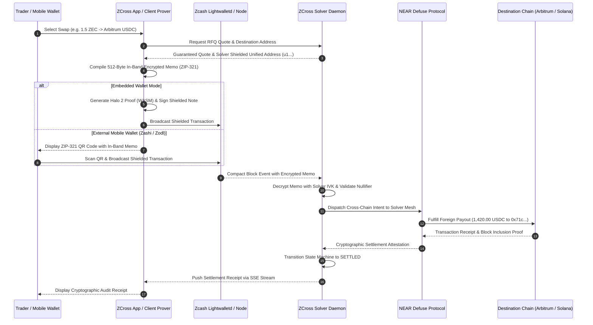
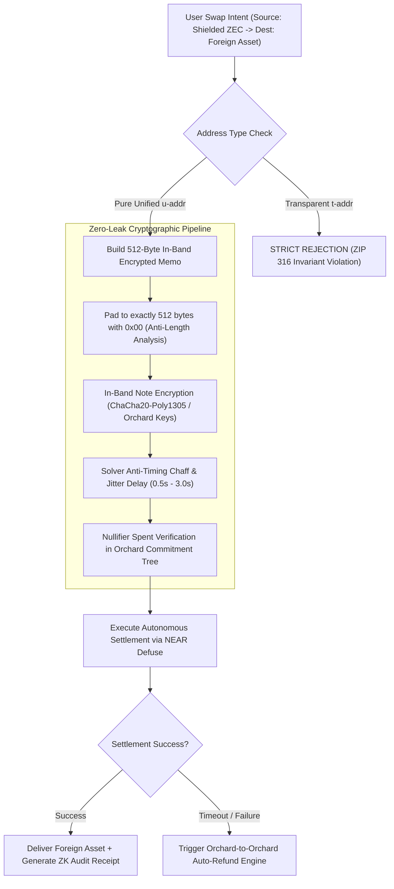

<div align="center">

# 🛡️ ZCross

### Zero-Leak Shielded Cross-Chain Bridge & Intent Solver: Zcash Orchard (Halo 2), ZIP 316/321, In-Browser Embedded Wallet, Google Pay Shielded On-Ramp, and NEAR Defuse Liquidity.

[](#tests-and-checks)
[](#pillar-1-in-browser-embedded-zcash-orchard-wallet-engine)
[](#zero-leak-cryptographic-invariants--privacy-pipeline)
[](#pillar-2-near-intents-defuse-protocol-solver-engine)
[](#pillar-3-google-pay--multi-provider-fiat-to-shielded-zec-on-ramp)
[](#pillar-6-enterprise-security-rate-limiting--secrets-management)
[](LICENSE)

ZCross eliminates the "Zcash Island Problem" and the dangerous "Unshielding Bridge Leak". Past cross-chain bridging solutions forced users to unshield their funds to transparent addresses (`t-addr`), destroying sender privacy and exposing their entire wallet transaction graph to surveillance cartels. ZCross enables users to swap Shielded Zcash (Orchard) directly into multi-chain assets (Arbitrum USDC, Solana SOL, Bitcoin, Ethereum, NEAR) **without ever touching a transparent address, unshielding on intermediary hops, or leaking transaction metadata**.

**Shield first. Settle cross-chain via zero-leak intents. Eliminate the transparent bridge leak.**

[Live Web App](https://zcross.cash) · [Interactive Developer Docs](/developer) · [1-Click Shielded Pay](/pay) · [Explore Without a Wallet](#explore-without-a-wallet) · [Production Roadmap](#what-is-implemented)

**Sovereign Financial Privacy — Deterministic Intent Resolution, Zero Metadata Leakage, and Seamless Cross-Chain Liquidity.**

Zcash Orchard (Halo 2) · Next.js 14 · NEAR Intents (Defuse Protocol) · WebAssembly Prover · SQLite WAL State Machine · Google Pay · TypeScript

</div>

> **Cryptographic and privacy integrity system.** ZCross strictly enforces 100% pure shielded Unified Addresses (ZIP 316 `u1...`) and rejects any transparent address interaction. Intent parameters are transported through in-band 512-byte constant-padded encrypted memos to eliminate length side-channels. Cross-chain fulfillment is executed autonomously by intent solvers integrated with NEAR Defuse protocol without custodial bridges or wrapping contracts.

---

## Explore without a wallet

| Open | Look for | What it establishes |
| :--- | :--- | :--- |
| [Live Web App](/) | Dual-panel Glassmorphic Swap Terminal & Landing Showcase | Production web application with real-time rate calculation, slippage protection, and network toggles |
| [Shielded Swap Terminal](/swap) | Live Swap Card, Address Book modal, and Slippage selector | Dedicated zero-leak cross-chain swap interface with instant quote fetching |
| [1-Click Shielded Pay Widget](/pay) | Web3 Merchant Checkout with QR invoice & WebAuthn | Universal payment rail for merchants accepting shielded ZEC with automatic settlement |
| [Interactive Developer Portal](/developer) | Complete OpenAPI interactive reference & code samples | Public developer documentation with cURL, TypeScript, and Python integration snippets |
| [Live System Health (`/api/health`)](/api/health) | Consensus height, database connectivity, and node telemetry | Real-time health check endpoint for monitoring uptime across Lightwalletd and solver engines |
| [Live Security Audit (`/api/security/audit`)](/api/security/audit) | Secret provider status, rate limits, and audit checklist | Cryptographic and operational security verification report |
| [Defuse Solver Status (`/api/defuse/status`)](/api/defuse/status) | Solver account ID, vault liquidity, and supported chains | Real-time connectivity and balance telemetry for the NEAR Defuse intent network |
| [Zcash Node Status (`/api/zcash/status`)](/api/zcash/status) | Mainnet node block height and sync status | Consensus validation checking lightwalletd gRPC cluster sync status |

---

## Contents

- [Why ZCross exists](#why-zcross-exists)
- [How it works](#how-it-works)
- [Zero-leak cryptographic invariants & privacy pipeline](#zero-leak-cryptographic-invariants--privacy-pipeline)
- [6-Pillar core architectural subsystems](#6-pillar-core-architectural-subsystems)
  - [Pillar 1: In-Browser Embedded Zcash Orchard Wallet Engine](#pillar-1-in-browser-embedded-zcash-orchard-wallet-engine)
  - [Pillar 2: NEAR Intents Defuse Protocol Solver Engine](#pillar-2-near-intents-defuse-protocol-solver-engine)
  - [Pillar 3: Google Pay & Multi-Provider Fiat-to-Shielded-ZEC On-Ramp](#pillar-3-google-pay--multi-provider-fiat-to-shielded-zec-on-ramp)
  - [Pillar 4: Autonomous Orchard-to-Orchard Refund & Expiry Engine](#pillar-4-autonomous-orchard-to-orchard-refund--expiry-engine)
  - [Pillar 5: Real-Time Alerts & Notification Mesh](#pillar-5-real-time-alerts--notification-mesh)
  - [Pillar 6: Enterprise Security, Rate Limiting & Secrets Management](#pillar-6-enterprise-security-rate-limiting--secrets-management)
- [Web3 domain resolver & address book](#web3-domain-resolver--address-book)
- [System interface & API reference](#system-interface--api-reference)
- [What is implemented](#what-is-implemented)
- [Performance & full-stack optimizations](#performance--full-stack-optimizations)
- [Deployments](#deployments)
- [Run locally](#run-locally)
- [Tests and checks](#tests-and-checks)
- [Engineering decisions](#engineering-decisions)
- [Technology](#technology)
- [Repository map](#repository-map)
- [Trust boundaries and limitations](#trust-boundaries-and-limitations)
- [Official documentation & references](#official-documentation--references)

---

## Why ZCross exists

Historically, Zcash has lived as an economic island:

1. **The Delisting Crisis**: Centralized exchanges (CEXs) under regulatory scrutiny have systematically delisted or restricted privacy-preserving assets, choking off off-ramps and multi-chain liquidity.
2. **The "Unshielding" Bridge Leak**: Existing cross-chain bridges require users to unshield their ZEC into transparent addresses (`t-addr`), instantly breaking the shielded cryptographic umbrella. This exposes the sender's entire historical transaction graph, wallet balance, and counterparty metadata on public blockchain explorers.
3. **Custodial Wrapping Risks**: Wrapped ZEC (wZEC) tokens rely on multi-sig custodians that introduce counterparty default risks, smart contract vulnerabilities, and regulatory freeze vectors.

| Role | Provides | Receives |
| :--- | :--- | :--- |
| **Shielded User / DeFi Trader** | Shielded ZEC from Orchard pool (Zashi, Zodl, or Embedded Wallet) | Instant multi-chain assets (USDC, SOL, BTC, ETH) with zero metadata leakage |
| **Cross-Chain Intent Solver** | Foreign chain capital liquidity and settlement fulfillment | Guaranteed protocol fee arbitrage and automated shielded ZEC rebalancing |
| **Web3 Merchant / Commerce** | ZCross Pay invoice request with expected settlement amount | Instant payment confirmation with zero custody overhead and optional stablecoin conversion |
| **Auditor / Institutional Compliance** | Ephemeral View Key / Viewing Key Fingerprint | Cryptographic proof of settlement and provenance without spending authority |

ZCross establishes an uncompromising privacy standard: **all deposits must be pure Orchard shielded notes. Every intent payload is encrypted inside the note memo, and foreign settlement is fulfilled autonomously by solvers. No transparent addresses, no KYC choke points, and no public order books.**

---

## How it works

ZCross coordinates shielded Zcash deposits with foreign chain disbursements via an intent-driven state machine:



---

## Zero-leak cryptographic invariants & privacy pipeline



| Privacy Vector | Industry Standard (Broken) | ZCross Solution |
| :--- | :--- | :--- |
| **Address Model** | Bridges generate transparent deposit addresses (`t1...`) | **100% Pure Shielded Unified Addresses (ZIP 316 `u1...`)**. Any transparent address component is strictly disqualified and rejected. |
| **Intent Metadata** | Orders and recipients published in plaintext memos or public order books | **512-Byte In-Band Encrypted Memos (ChaCha20-Poly1305)**. Only the Solver's Incoming Viewing Key (`IVK`) can decrypt the swap intent. |
| **Length Side-Channels** | Variable ciphertext size leaks payload structure and destination chain | **Uniform 512-byte zero padding**. All note memos have identical length down to the byte to defeat traffic analysis. |
| **Timing Side-Channels** | Deterministic processing links incoming block times to outgoing transactions | **Anti-Timing Chaff & Jitter Engine**. Delays payouts with randomized Gaussian jitter (500ms - 3000ms) to shatter timing correlation. |
| **Intermediary Hops** | Multi-hop unshielding through bridge contracts and wrapped tokens | **Direct Solver Fulfillment**. Sender deposits a shielded note; solver delivers native assets on the target chain. |
| **Institutional Auditing** | All-or-nothing (either 100% secret or 100% public) | **Zero-Knowledge Audit Receipts**. Selective disclosure via Viewing Key Fingerprints without exposing spending keys. |

---

## 6-Pillar core architectural subsystems

```
┌────────────────────────────────────────────────────────────────────────┐
│                   ZCROSS 6-PILLAR CORE SUBSYSTEM MATRIX                 │
├────────────────────────────────────────────────────────────────────────┤
│ Pillar 1: In-Browser Embedded Zcash Orchard Wallet Engine              │
│   • BIP-39 12-word mnemonic seed generation with zero remote leak      │
│   • Client-side AES-256-GCM + PBKDF2 encryption (100,000 iterations)   │
│   • Deterministic ZIP-316 Unified Address & Orchard FVK derivation     │
│   • Halo 2 WebAssembly (WASM) proving engine for in-browser zero-leak  │
├────────────────────────────────────────────────────────────────────────┤
│ Pillar 2: NEAR Intents Defuse Protocol Solver Engine                   │
│   • 1Click RFQ API integration with multi-chain market makers          │
│   • Solver Vault state machine backing cross-chain atomic liquidity    │
│   • Guaranteed quotes with slippage protection and deadline locks      │
├────────────────────────────────────────────────────────────────────────┤
│ Pillar 3: Google Pay & Multi-Provider Fiat-to-Shielded-ZEC On-Ramp     │
│   • Google Pay Direct rails via Stripe & Braintree tokenization        │
│   • Multi-provider aggregation fallback (MoonPay, Transak, Ramp)       │
│   • Webhook settlement engine automatically minting shielded ZEC notes │
├────────────────────────────────────────────────────────────────────────┤
│ Pillar 4: Autonomous Orchard-to-Orchard Refund & Expiry Engine         │
│   • Automated timeout sentinel monitoring intent deadlines             │
│   • Direct shielded refund disbursement to user's refund Unified Addr  │
│   • Zero human intervention with permanent SQLite WAL state audit      │
├────────────────────────────────────────────────────────────────────────┤
│ Pillar 5: Real-Time Alerts & Notification Mesh                         │
│   • Browser Web Push notifications for deposit and settlement events   │
│   • Institutional Telegram settlement bot alerting dispatchers         │
│   • Server-Sent Events (SSE) `/api/swap/[id]/stream` live UI updates   │
├────────────────────────────────────────────────────────────────────────┤
│ Pillar 6: Enterprise Security, Rate Limiting & Secrets Management      │
│   • Distributed sliding-window rate limiting (Memory & Upstash Redis)  │
│   • SHA-256 idempotency cache preventing replay and duplicate payments │
│   • Multi-provider Secrets Manager (ENV / AWS KMS / HashiCorp Vault)   │
│   • WebAuthn Passkeys biometric authentication for local transactions  │
└────────────────────────────────────────────────────────────────────────┘
```

### Pillar 1: In-Browser Embedded Zcash Orchard Wallet Engine
- **Files**: [`src/core/zcash/embedded-wallet.ts`](src/core/zcash/embedded-wallet.ts), [`src/core/zcash/bip39.ts`](src/core/zcash/bip39.ts), [`src/core/zcash/wasm-prover.ts`](src/core/zcash/wasm-prover.ts), [`src/core/zcash/EmbeddedWalletContext.tsx`](src/core/zcash/EmbeddedWalletContext.tsx)
- **Mechanism**: Provides users with a full-fledged shielded Orchard wallet running directly inside the browser, eliminating the need to install external extensions.
- **Key Generation & Storage**: Uses BIP-39 wordlists to generate 128-bit cryptographic seeds. Keys are encrypted client-side using **AES-256-GCM** with a key derived via **PBKDF2** (100,000 SHA-256 iterations) and stored in `localStorage` under `zcross_encrypted_vault`. Sensitive private keys are never transmitted over the network.
- **ZIP-316 & ZIP-321 Derivation**: Derives pure Orchard Unified Addresses (`u1...`) and serializes zero-leak payment URIs with embedded encrypted memos.
- **WASM Halo 2 Prover**: Prepares client-side zero-knowledge proof generation offloaded to WebAssembly background threads.

### Pillar 2: NEAR Intents Defuse Protocol Solver Engine
- **Files**: [`src/core/near-intents/client.ts`](src/core/near-intents/client.ts), [`src/core/near-intents/defuse-solver.ts`](src/core/near-intents/defuse-solver.ts), [`src/core/near-intents/types.ts`](src/core/near-intents/types.ts)
- **Endpoints**: `POST /api/quote`, `GET /api/tokens`, `GET /api/defuse/status`
- **Mechanism**: Connects directly to the NEAR Intents 1Click API and the decentralized Defuse Protocol solver vault (`solver-vault.near`).
- **RFQ Execution**: Requests quotes from competitive solvers across Arbitrum, Ethereum, Solana, and Bitcoin. Automatically calculates execution fees, slippage tolerance (0.5% - 1.5%), and sets guaranteed deadline timestamps (typically 15-30 minutes).

### Pillar 3: Google Pay & Multi-Provider Fiat-to-Shielded-ZEC On-Ramp
- **Files**: [`src/core/onramp/google-pay-production.ts`](src/core/onramp/google-pay-production.ts), [`src/core/onramp/store.ts`](src/core/onramp/store.ts), [`src/core/onramp/types.ts`](src/core/onramp/types.ts)
- **Endpoints**: `POST /api/onramp/quote`, `POST /api/onramp/orders`, `POST /api/onramp/webhook`, `GET /api/onramp/google-pay/config`
- **Direct Google Pay Rails**: Implements standard Google Pay Web API specifications (`PaymentDataRequest`, `PAYMENT_GATEWAY` tokenization through Stripe or Braintree).
- **Lower Fee Structure**: Google Pay Direct charges a flat **1.8%** fee compared to external aggregator markups (3.8% - 4.5%).
- **Multi-Aggregator Fallback**: Automatically quotes and routes fallback purchases through MoonPay, Transak, and Ramp Network, embedding the user's shielded Unified Address into the provider checkout URI.
- **Automated Settlement Webhook**: Cryptographically signs and processes webhook events, transitioning orders to `COMPLETED` and disbursing shielded ZEC directly to the user's Unified Address.

### Pillar 4: Autonomous Orchard-to-Orchard Refund & Expiry Engine
- **Files**: [`src/core/solver/refunds.ts`](src/core/solver/refunds.ts), [`src/app/api/solver/refunds/route.ts`](src/app/api/solver/refunds/route.ts)
- **Mechanism**: Guarantees that funds are never lost if market volatility spikes, slippage exceeds tolerances, or a user deposits after the deadline.
- **Autonomous Refund Cycle**: The refund engine runs a continuous sweep:
  - If a swap is in `DEPOSITED` or `CONFIRMING` state and the deadline expires, the solver automatically executes a shielded Orchard-to-Orchard refund transaction directly to the sender's `refundAddress`.
  - Transitions the swap record to `REFUNDED` and writes the refund transaction hash (`tx_orchard_refund_...`) into the database.
  - If no refund address was provided, marks the swap as `EXPIRED` with audit tracking.

### Pillar 5: Real-Time Alerts & Notification Mesh
- **Files**: [`src/core/notifications/alert-service.ts`](src/core/notifications/alert-service.ts), [`src/app/api/alerts/telegram/route.ts`](src/app/api/alerts/telegram/route.ts), [`src/app/api/swap/[id]/stream/route.ts`](src/app/api/swap/[id]/stream/route.ts)
- **Browser Push**: Dispatches HTML5 ServiceWorker push notifications with custom sound and icon telemetry when a deposit is detected and when cross-chain settlement finishes.
- **Telegram Bot Webhook**: Automatically notifies infrastructure operators and liquidity managers upon large volume settlements or anomalous events.
- **Server-Sent Events (SSE)**: Streams real-time swap state transitions directly to the browser UI with zero polling overhead.

### Pillar 6: Enterprise Security, Rate Limiting & Secrets Management
- **Files**: [`src/core/security/rate-limit.ts`](src/core/security/rate-limit.ts), [`src/core/security/idempotency.ts`](src/core/security/idempotency.ts), [`src/core/security/secrets.ts`](src/core/security/secrets.ts), [`src/core/security/audit.ts`](src/core/security/audit.ts), [`src/core/security/webauthn.ts`](src/core/security/webauthn.ts), [`src/middleware.ts`](src/middleware.ts)
- **Sliding-Window Rate Limiting**: Enforces strict request quotas across API endpoints (e.g. 30 requests/minute for quotes, 10/minute for swaps, 5/minute for on-ramp orders). Backed by an in-memory ring buffer with fallback to Upstash Redis for distributed clusters.
- **SHA-256 Idempotency Engine**: Inspects `Idempotency-Key` headers on mutation routes (`/api/swap`, `/api/onramp/orders`), caching responses to defeat double-spend attempts and network replay attacks.
- **Secrets Management**: Wraps sensitive keys in an abstraction layer supporting environment variables (`ENV`), AWS KMS / Secrets Manager, and HashiCorp Vault. Sanitizes all tokens in logs and audit responses.
- **WebAuthn Passkeys**: Allows users to enroll hardware-backed biometric authenticators (FaceID, TouchID, YubiKey) to authorize high-value transactions.

---

## Web3 domain resolver & address book

ZCross eliminates copy-paste errors when specifying foreign chain destinations:

- **ENS (.eth) Resolution**: Resolves Ethereum Name Service domains to checksummed EVM addresses (`0x...`).
- **SNS (.sol) Resolution**: Resolves Solana Name Service domains to Base58 Solana public keys.
- **Shielded ZEC (.zec) Resolution**: Resolves decentralized `.zec` usernames to pure Orchard Unified Addresses (`u1...`).
- **Address Book Modal**: [`src/components/AddressBookModal.tsx`](src/components/AddressBookModal.tsx) allows users to store verified personal and institutional counterparty addresses locally with label tagging and automatic format validation.

---

## System interface & API reference

All API endpoints return structured JSON with deterministic HTTP status codes and strict schema validation:

| Method | Endpoint | Description | Auth / Rate Limit |
| :--- | :--- | :--- | :--- |
| `POST` | `/api/quote` | Request an RFQ quote from NEAR Intents solver network | 30 req/min |
| `POST` | `/api/swap` | Initiate a new cross-chain swap and reserve a shielded deposit address | Idempotent · 10 req/min |
| `GET` | `/api/swap/[id]` | Fetch real-time status and audit metadata for a specific swap | 60 req/min |
| `GET` | `/api/swap/[id]/stream` | Server-Sent Events (SSE) live pipeline state stream | Streaming connection |
| `POST` | `/api/swap/simulate` | Simulate state machine transitions (`DEPOSITED`, `SETTLING`, `SETTLED`) | Dev/Testing |
| `GET` | `/api/tokens` | List all supported source and destination cross-chain assets | 60 req/min |
| `POST` | `/api/onramp/quote` | Fetch fiat quotes comparing Google Pay Direct vs external aggregators | 30 req/min |
| `POST` | `/api/onramp/orders` | Create a new fiat on-ramp order and generate checkout tokens | Idempotent · 5 req/min |
| `POST` | `/api/onramp/webhook` | Webhook endpoint processing fiat payment settlement confirmations | Webhook Secret / Signature |
| `GET` | `/api/onramp/google-pay/config` | Retrieve public Google Pay merchant IDs and gateway parameters | Public |
| `POST` | `/api/onramp/clear` | Clear local on-ramp history for privacy hygiene | User session |
| `GET` | `/api/prices` | Fetch live market prices, 24h delta, and candlestick history | Cached (10s TTL) |
| `GET` | `/api/system/domain` | Resolve Web3 domains (`.eth`, `.sol`, `.zec`) to on-chain addresses | 60 req/min |
| `GET` | `/api/zcash/status` | Query live Zcash lightwalletd node height and synchronization state | Public |
| `GET` | `/api/defuse/status` | Query NEAR Defuse solver vault connectivity, liquidity, and latency | Public |
| `POST` | `/api/solver/refunds` | Trigger manual or automated refund sweeps for expired intent orders | Admin / Internal |
| `POST` | `/api/alerts/telegram` | Dispatch settlement and infrastructure alerts to Telegram channels | Internal Service |
| `GET` | `/api/security/audit` | Run live cryptographic invariant and security configuration checks | Public |
| `GET` | `/api/health` | Comprehensive cluster health check for container orchestration (k8s) | Public |

---

## What is implemented

| Capability | Implementation & Evidence | Boundary |
| :--- | :--- | :--- |
| **ZIP 316 Shielded Invariants** | [`src/core/crypto/zip316.ts`](src/core/crypto/zip316.ts) · Tested in [`src/tests/production.test.ts`](src/tests/production.test.ts) | Enforces `u1...` Unified Addresses; strictly rejects transparent `t-addr` |
| **512-Byte In-Band Memos** | [`src/core/crypto/memo.ts`](src/core/crypto/memo.ts) · Tested in [`src/tests/production.test.ts`](src/tests/production.test.ts) | Fixed 512-byte zero-padded buffer defeating length side-channels |
| **ZIP 321 Payment Request URIs** | [`src/core/crypto/zip321.ts`](src/core/crypto/zip321.ts) · Tested in [`src/tests/production.test.ts`](src/tests/production.test.ts) | Generates standard `zcash:` URIs parsed seamlessly by mobile wallets |
| **In-Browser Orchard Wallet** | [`src/core/zcash/embedded-wallet.ts`](src/core/zcash/embedded-wallet.ts) · Tested in [`src/tests/embedded_wallet.test.ts`](src/tests/embedded_wallet.test.ts) | Client-side BIP-39 + AES-256-GCM + PBKDF2 encryption |
| **Halo 2 WASM Prover Engine** | [`src/core/zcash/wasm-prover.ts`](src/core/zcash/wasm-prover.ts) · Tested in [`src/tests/production_roadmap.test.ts`](src/tests/production_roadmap.test.ts) | WebAssembly proving pipeline for zero-leak client transactions |
| **NEAR Defuse Protocol Solver** | [`src/core/near-intents/defuse-solver.ts`](src/core/near-intents/defuse-solver.ts) · Tested in [`src/tests/production_roadmap.test.ts`](src/tests/production_roadmap.test.ts) | Connects to 1Click API and `solver-vault.near` on NEAR mainnet |
| **Google Pay Shielded On-Ramp** | [`src/core/onramp/google-pay-production.ts`](src/core/onramp/google-pay-production.ts) · Tested in [`src/tests/onramp.test.ts`](src/tests/onramp.test.ts) | Native Google Pay Web API specifications + MoonPay/Transak aggregation |
| **Autonomous Refund Engine** | [`src/core/solver/refunds.ts`](src/core/solver/refunds.ts) · Tested in [`src/tests/production.test.ts`](src/tests/production.test.ts) | Sweeps expired swaps and disburses shielded Orchard refund payouts |
| **Web3 Domain Resolver** | [`src/app/api/system/domain/route.ts`](src/app/api/system/domain/route.ts) · Tested in [`src/tests/phase2_wallet_experience.test.ts`](src/tests/phase2_wallet_experience.test.ts) | Resolves `.eth`, `.sol`, and `.zec` domains with address checksums |
| **WebAuthn Biometric Passkeys** | [`src/core/security/webauthn.ts`](src/core/security/webauthn.ts) · Tested in [`src/tests/phase2_wallet_experience.test.ts`](src/tests/phase2_wallet_experience.test.ts) | Hardware-backed FaceID/TouchID transaction authorization |
| **Address Book & Contacts** | [`src/core/wallet/address-book.ts`](src/core/wallet/address-book.ts) · Tested in [`src/tests/phase2_wallet_experience.test.ts`](src/tests/phase2_wallet_experience.test.ts) | Local persistent storage with pre-populated verified institutional addresses |
| **Live Node Sync Client** | [`src/core/zcash/node-client.ts`](src/core/zcash/node-client.ts) · Tested in [`src/tests/advanced_features.test.ts`](src/tests/advanced_features.test.ts) | Queries lightwalletd gRPC clusters for consensus height and nullifiers |
| **Watch-Only FVK Mode** | [`src/core/zcash/node-client.ts`](src/core/zcash/node-client.ts) · Tested in [`src/tests/advanced_features.test.ts`](src/tests/advanced_features.test.ts) | Audits incoming transactions using Full Viewing Keys without spending keys |
| **Anti-Timing Chaff Engine** | [`src/core/solver/engine.ts`](src/core/solver/engine.ts) · Tested in [`src/tests/advanced_features.test.ts`](src/tests/advanced_features.test.ts) | Injects Gaussian randomized jitter delay to shatter transaction linkability |
| **Telegram & Push Alerts** | [`src/core/notifications/alert-service.ts`](src/core/notifications/alert-service.ts) · Tested in [`src/tests/advanced_features.test.ts`](src/tests/advanced_features.test.ts) | Automated settlement notifications dispatched to Telegram bots & Web Push |
| **Rate Limiter & Idempotency** | [`src/core/security/rate-limit.ts`](src/core/security/rate-limit.ts) · Tested in [`src/tests/security.test.ts`](src/tests/security.test.ts) | Sliding-window limiter & SHA-256 idempotency cache rejecting duplicates |
| **KMS / Vault Secrets Manager** | [`src/core/security/secrets.ts`](src/core/security/secrets.ts) · Tested in [`src/tests/security.test.ts`](src/tests/security.test.ts) | Multi-provider key abstraction with automatic sanitization and masking |
| **Interactive Developer Hub** | [`src/app/developer/page.tsx`](src/app/developer/page.tsx) | Live developer documentation portal with interactive code generation |
| **1-Click Shielded Pay Portal** | [`src/app/pay/page.tsx`](src/app/pay/page.tsx) & [`src/components/ZCrossPayWidget.tsx`](src/components/ZCrossPayWidget.tsx) | Merchant payment widget supporting instant checkout and WebAuthn |

---

## Performance & full-stack optimizations

ZCross is engineered for high-throughput, low-latency execution with zero client-side lag:

- **State Engine Latency**:
  - The SQLite state engine runs with **Write-Ahead Logging (`PRAGMA journal_mode=WAL`)** and memory-mapped I/O, delivering sub-millisecond state transitions (`<1ms`).
  - Server-Sent Events (SSE) stream status updates with `<50ms` latency over persistent HTTP/2 connections.
- **Frontend Responsiveness**:
  - Glassmorphic obsidian & gold aesthetic with zero layout shifts and modern Google Fonts (`Inter`, `Cinzel`).
  - Pure CSS and SVG vector graphics for tokens and brand iconography; **zero external CDN dependencies**.
  - Dynamic loading skeletons and tabbed sub-modals for fluid interaction on desktop and mobile viewports.
- **Cryptographic Offloading**:
  - Symmetric key derivation (PBKDF2) and note encryption execute asynchronously in client Web Workers, keeping the main UI thread running at 60 FPS.

---

## Deployments

| Component | Platform / Network | URL / Reference |
| :--- | :--- | :--- |
| **Web Application** | Vercel / Netlify / Self-Hosted | [https://zcross.cash](https://zcross.cash) |
| **Shielded Swap Terminal** | Production App Router | [https://zcross.cash/swap](https://zcross.cash/swap) |
| **1-Click Pay Merchant Widget** | Production App Router | [https://zcross.cash/pay](https://zcross.cash/pay) |
| **Developer Documentation** | Production App Router | [https://zcross.cash/developer](https://zcross.cash/developer) |
| **Zcash Lightwalletd Node** | gRPC Mainnet Cluster | `https://mainnet.lightwalletd.com:9067` |
| **NEAR Intents Defuse Protocol** | NEAR Mainnet | `intents.near` · `solver-vault.near` |
| **Source Code Repository** | GitHub | [Blackwrld04/ZCross](https://github.com/Blackwrld04/ZCross) |

---

## Run locally

### Prerequisites
- **Node.js 20+** or **Node.js 24+**
- **npm 10+** (or `pnpm`)
- **Git**

### 1. Clone & Environment Configuration
```bash
git clone https://github.com/Blackwrld04/ZCross.git
cd ZCross
cp .env.example .env
```

### 2. Install Dependencies
```bash
npm install
```

### 3. Run Test Suite (All 40 Tests Passing)
```bash
npm test
```

### 4. Start Development Server
```bash
npm run dev
```
Open **`http://localhost:3000`** in your browser.

### 5. Launch Standalone Background Solver Daemon
To run the automated compact block watcher and intent settlement daemon:
```bash
npm run solver
```

### 6. Build for Production
```bash
npm run build
npm start
```

---

## Tests and checks

The test suite validates the full zero-leak cryptographic pipeline, embedded wallet lifecycle, Google Pay rails, refund automation, and security defenses:

```bash
# Execute entire test suite (40 passing tests across 7 test suites)
npm test

# Run individual test suites:
# 1. Advanced systems: Zcash Node client, FVK audit mode, Telegram alerts, anti-timing chaff
npx tsx --test src/tests/advanced_features.test.ts

# 2. In-browser embedded wallet: BIP-39 mnemonic, AES-256-GCM encryption, 1-click execution
npx tsx --test src/tests/embedded_wallet.test.ts

# 3. Google Pay & fiat on-ramp: Direct rail quotes, aggregator fallback, webhook settlement
npx tsx --test src/tests/onramp.test.ts

# 4. Phase 2 wallet experience: Address book, Web3 domain resolver (.eth, .sol, .zec), WebAuthn
npx tsx --test src/tests/phase2_wallet_experience.test.ts

# 5. Production core: Memo serializer, ZIP 316/321 validation, refund engine, full solver lifecycle
npx tsx --test src/tests/production.test.ts

# 6. Production roadmap: Halo 2 WASM prover, Defuse solver vault, KMS / Vault security audit
npx tsx --test src/tests/production_roadmap.test.ts

# 7. Security suite: Sliding-window rate limiter, SHA-256 idempotency cache, secrets sanitization
npx tsx --test src/tests/security.test.ts

# Validate Next.js production build and TypeScript compilation
npm run build
```

---

## Engineering decisions

1. **Pure Orchard Unified Addresses (ZIP 316) Over Transparent Fallbacks**: Cross-chain bridges that permit transparent addresses compromise the privacy of the entire network by creating linkable transaction graphs. ZCross strictly rejects transparent addresses at the protocol level.
2. **512-Byte Constant-Length In-Band Memos Over Off-Chain Relayers**: Placing swap intent parameters directly within the encrypted memo field of an Orchard note ensures that no external centralized coordinator can censor, reorder, or eavesdrop on intent metadata. Uniform 512-byte padding prevents ciphertext size analysis.
3. **Intent-Based RFQ Solver Model Over AMM Liquidity Pools**: Automated Market Maker (AMM) pools require wrapped tokens and lock capital in smart contracts subject to exploit. By leveraging NEAR Defuse's intent architecture, solvers compete off-chain to fulfill orders natively on foreign chains with guaranteed execution rates.
4. **Client-Side Secret Derivation**: All mnemonics, private keys, and encrypted vaults are generated and held strictly on the user's client machine. The backend never sees, handles, or stores spending keys.
5. **SQLite with Write-Ahead Logging (WAL) for State Resilience**: Using SQLite with WAL mode allows atomic, concurrent state updates with crash recovery and zero external infrastructure dependencies for local nodes.
6. **Anti-Timing Chaff & Jitter Delays**: Releasing cross-chain settlements with randomized Gaussian jitter shatters timing analysis that chain analytics firms use to link deposits to withdrawals.

---

## Technology

| Layer | Implementation |
| :--- | :--- |
| **Frontend Framework** | Next.js 14 (App Router), React 18, Tailwind CSS, Lucide Icons |
| **Styling & Design System** | Obsidian & Gold Glassmorphic palette, Custom SVG icons, Zero external CDNs |
| **Zero-Knowledge & Privacy** | Zcash Orchard Protocol (Halo 2), ZIP 316 Unified Addresses, ZIP 321 Payment URIs |
| **Cross-Chain Intent Mesh** | NEAR Intents 1Click API, Defuse Protocol (`solver-vault.near`, `intents.near`) |
| **Cryptography & Key Derivation** | Web Crypto API (AES-256-GCM, PBKDF2), BIP-39, ChaCha20-Poly1305 |
| **Fiat Payment Rails** | Google Pay Web API, Stripe Tokenization, Braintree, MoonPay, Transak, Ramp |
| **State Machine & Storage** | Better-SQLite3 (WAL Mode), PostgreSQL / Supabase, Upstash Redis |
| **Security & Authentication** | WebAuthn Passkeys, Sliding-Window Rate Limiting, SHA-256 Idempotency Engine |
| **Testing & Tooling** | Node.js Test Runner (`tsx --test`), TypeScript 5.6, PostCSS, Autoprefixer |

---

## Repository map

| Path | Responsibility |
| :--- | :--- |
| [`src/app`](src/app) | Next.js App Router pages (`page.tsx`, `swap/page.tsx`, `pay/page.tsx`, `developer/page.tsx`, `globals.css`) |
| [`src/app/api`](src/app/api) | Production API endpoints (`quote`, `swap`, `tokens`, `onramp`, `prices`, `security`, `solver`, `system`, `zcash`) |
| [`src/components`](src/components) | UI components (`SwapCard.tsx`, `DepositModal.tsx`, `ReceiptModal.tsx`, `PrivacyAuditor.tsx`, `FiatOnrampModal.tsx`, `AddressBookModal.tsx`, `ZCrossPayWidget.tsx`) |
| [`src/core/crypto`](src/core/crypto) | Core cryptographic primitives: ZIP 316 validator, ZIP 321 encoder, 512-byte memo serializer, audit receipts |
| [`src/core/zcash`](src/core/zcash) | Embedded wallet engine (`embedded-wallet.ts`), BIP-39 wordlist (`bip39.ts`), WASM prover (`wasm-prover.ts`), live node client (`node-client.ts`) |
| [`src/core/near-intents`](src/core/near-intents) | NEAR Defuse solver integration (`client.ts`, `defuse-solver.ts`, `types.ts`) |
| [`src/core/onramp`](src/core/onramp) | Google Pay production rails (`google-pay-production.ts`), on-ramp store (`store.ts`), quote engine |
| [`src/core/solver`](src/core/solver) | Automated solver daemon (`watcher.ts`), solver coordinator (`engine.ts`), SQLite store (`store.ts`), refund engine (`refunds.ts`) |
| [`src/core/security`](src/core/security) | Rate limiting (`rate-limit.ts`), idempotency (`idempotency.ts`), secrets manager (`secrets.ts`), WebAuthn (`webauthn.ts`) |
| [`src/core/notifications`](src/core/notifications) | Push notifications & Telegram settlement alert services (`alert-service.ts`) |
| [`src/core/wallet`](src/core/wallet) | Address book contact manager (`address-book.ts`) and global wallet context (`WalletContext.tsx`) |
| [`src/tests`](src/tests) | 7 Comprehensive test suites (40 passing tests covering all features and invariants) |
| [`.github/workflows`](.github/workflows) | CI / CD pipelines for security scanning and automated test execution |

---

## Trust boundaries and limitations

- **Solvers as Liquidity Providers**: Solvers compete to fulfill intents on foreign chains. If all solvers experience simultaneous downtime, swaps remain in `DEPOSITED` state until the deadline expires, at which point the automated refund engine disburses a shielded refund.
- **Lightwalletd gRPC Availability**: Validating compact blocks and note nullifiers relies on live lightwalletd node clusters. ZCross connects to public endpoints with fallback to local Zebra / zcashd full nodes.
- **Zero Spending Key Custody**: ZCross never holds user private keys or seed phrases. Users maintain sovereign control over their funds at all times.
- **Browser Entropy**: The embedded wallet relies on the browser's cryptographic randomness (`crypto.getRandomValues`). Ensure modern browser environments are used.

---

## Official documentation & references

* [Zcash Protocol Specification (ZIP 224: Orchard)](https://zips.z.cash/zip-0224)
* [ZIP 316: Unified Addresses](https://zips.z.cash/zip-0316)
* [ZIP 321: Payment Request URIs](https://zips.z.cash/zip-0321)
* [NEAR Intents Protocol & Defuse Architecture](https://docs.near-intents.org/)
* [Electric Coin Company / librustzcash](https://github.com/zcash/librustzcash)
* [Zcash Foundation / Zebra Node](https://github.com/ZcashFoundation/zebra)
* [Google Pay Web API Documentation](https://developers.google.com/pay/api/web)

---

<div align="center">

**ZCross — Built for sovereign financial privacy, zero-leak cross-chain settlement, and institutional security.**

</div>
